## 🃏 About Catch Eleven

On my return trip from **Berlin**, late at night on the train, I decided to start developing **Catch Eleven**, a classic Persian card game.
I wanted to spend my time on something **useful, educational, and fun** — and maybe make the journey feel a little shorter.

During that trip, I built the fundamental structure of the program, and I’ll continue improving it in the future.

## 🏗️ Project Architecture

This project uses **Clean Architecture**. This separates the code into different layers. This makes the project easy to test, maintain, and add new features to.

The solution is split into these main projects:

* **`src/CatchEleven.Domain`**: Holds the core game models (like `Card`, `Player`) and rules.
* **`src/CatchEleven.Application`**: Contains all the game logic, or "how to play" (like `GameService`).
* **`src/CatchEleven.Infrastructure`**: Implements services that talk to the "outside world," like the console.
* **`src/CatchEleven.ConsoleUI`**: The main application that starts the game. It connects all the layers.
* **`tests/CatchEleven.Tests`**: Unit tests for the core logic, written using **XUnit.net**.

## 💻 UI (User Interface)

Because of the Clean Architecture, the core game logic (`Application` and `Domain`) does not know about the `ConsoleUI`.

This means the project is ready for any new UI. We can add a **WPF**, or **Web API + Angular** project. The main game logic will not need to change.

The plan for the future is to add an **Angular** front end.

---

## 🃏 Game Rules — Catch Eleven

**Catch Eleven** is a modern digital version of the traditional Persian card game *Pasoor (also called "Yazdeh")*.  
The goal is to collect cards from the table by making combinations that add up to **11** or by using special face-card rules.

---

### 🎯 Goal of the Game
Players try to **capture cards** from the table to earn points.  
You can take cards when:
- The **sum of card values equals 11**, or  
- You play a **King, Queen, or Jack** that matches the special rules below.

At the end of each round, players count their captured cards and score points.  
The first player (or team) to reach the target score wins.

---

### 👥 Number of Players
- Usually **2 players**.  
- Can also be played with **4 players (two teams)**.  
- Teammates sit opposite each other.

---

### 🎴 Cards
- The game uses a **standard 52-card deck** (no Jokers).
- Card values are:

| Card | Value for sum-to-11 | Rule / Notes |
|-------|----------------------|---------------|
| A (Ace) | 1 | Used only to make 11 |
| 2–10 | Face value | Normal numbers for combinations |
| J (Jack) | — | Takes **all** cards from the table |
| Q (Queen) | — | Takes **only** another Queen |
| K (King) | — | Takes **only** another King |

---

### 🔄 Dealing the Cards
1. Shuffle the deck well.  
2. Deal **4 cards to each player**.  
3. Place **4 cards face-up on the table**.  
4. Keep the rest of the deck aside — new hands will be dealt later.  
5. The starting player can be chosen randomly (or the winner of the previous round starts next).

---

### 🎮 How to Play
Players take turns, one card per turn:

1. On your turn, **play one card** from your hand.  
2. If that card can **capture** any cards from the table, take them and keep them face-down in your pile.  
3. If it cannot capture anything, **place it on the table** face-up.  
4. Continue until everyone’s hand is empty.  
5. Then deal the next 4 cards to each player (no new cards on the table).  
6. Repeat until the whole deck (52 cards) has been played.

---

### ⚙️ Capturing Rules

#### 1️⃣ Normal Rule — Make 11
If the total value of your played card and one or more table cards equals **11**,  
you can take those cards.

**Examples:**
- Table has 9♦ → you play 2♣ → total = 11 ✅  
- Table has 8♠ + 3♥ → you play nothing else → total = 11 ✅  
- Table has 7♦ + 5♣ → too high ❌ 
- Face cards (J, Q, K) never count in the 11-sum rule.

---

#### 👑 Special Cards
- **King (K):** Takes **only** another King.  
- **Queen (Q):** Takes **only** another Queen.  
- **Jack (J):** Takes **all** cards from the table.  
  - If the table is empty, the Jack does nothing.  
- **Ace (A):** Counts as **1** when making 11.

---

### 💥 Special Bonus — Basaat (Clear Table)
If you clear **all cards** from the table in one move  
(and not by using a Jack),  
you earn **+10 bonus point** called *Basaat*.

---

### 🧮 Scoring at the End of Each Round

When all 52 cards are played, count each player’s captured cards.

| Category | Condition | Points |
|-----------|------------|--------|
| 🃏 **Most Cards** | Player with the most captured cards | +3 |
| 💎 **Most Diamonds (♦)** | Player with the most ♦ cards | +1 |
| ♦️ **Two of Diamonds (2♦)** | Always worth | +2 |
| 🤴 **Jack of Diamonds (J♦)** | Always worth | +1 |
| 🌟 **Basaat (Clear Table)** | Clearing the table (not with Jack) | +10 |

> ⚠️ If two players tie in total cards or Diamonds,  
> nobody gets that bonus.

---

### 🏆 Winning the Game
- **2-Player Mode:** First to reach **62 points** wins.  
- **Team Mode (4 players):** First team to reach **120 points** wins.

---

### 🧠 Strategy Tips
- Remember which cards have already been played or captured.  
- Save your **Jack (J)** for when the table has many cards.  
- Try to collect **Diamonds (♦)** — they give extra points.  
- If you can clear the table without a Jack, do it — it’s worth a *Basaat* bonus.  
- Always watch what your opponent captures; this helps you guess their hand.

---

### ⚡ Summary
| Term | Meaning |
|------|----------|
| **Deck** | All 52 cards used in the game |
| **Hand** | The cards currently in a player’s hand |
| **Table Cards** | Cards visible on the table |
| **Captured Cards** | Cards a player has taken and kept |
| **Basaat** | Clearing the table for +10 point |
| **Round** | One full playthrough of the deck |

-----

# 🔄 Game Flow Architecture

## 🎮 Overall Game Flow

```mermaid
graph TD
    A[🎮 Start Game] --> B[Initialize Services & Players]
    B --> C{Main Game Loop<br>Scores < Target?}
    
    C -->|Yes| D[🔄 Run Round]
    D --> E[Reset Deck & Clear Collections]
    E --> F[🔀 Shuffle Deck]
    F --> G[🤲 Deal Initial Cards<br>4 each player + 4 table]
    G --> H[🎲 Choose Starting Player Randomly]
    H --> I{Round Loop}
    
    I --> J{Hands Empty?}
    J -->|Yes| K{Deck Empty?}
    K -->|No| L[🤲 Deal New Hands<br>4 cards each]
    L --> I
    K -->|Yes| M[🧮 Calculate Round Scores]
    
    J -->|No| N{Current Player}
    N -->|Human| O[🧑‍💻 Human Turn]
    N -->|Robot| P[🤖 Robot Turn]
    O --> Q[🔄 Switch Player]
    P --> Q
    Q --> I
    
    M --> C
    C -->|No| R[🏆 Game Over]
```

## 🧑‍💻 Human Turn Flow

```mermaid
graph TD
    A[🧑‍💻 Human Turn] --> B[Display Table & Hand]
    B --> C[Get Card Choice from Input]
    C --> D[Play Selected Card]
    
    D --> E{Card Type?}
    E -->|Jack| F[HandleJackPlay]
    E -->|King/Queen| G[HandleKingQueenPlay]
    E -->|Number Card| H[Find Sum-to-11 Combinations]
    
    F --> I{Table Empty?}
    I -->|No| J[🎯 Capture All Cards]
    I -->|Yes| K[📤 Discard to Table]
    
    G --> L{Matching Card on Table?}
    L -->|Yes| M[🤝 Capture Pair + Check Basaat]
    L -->|No| K
    
    H --> N{Combinations Found?}
    N -->|Yes| O[Let Human Choose Combination]
    O --> P[🎯 Capture Combination + Check Basaat]
    N -->|No| K
    
    J --> Q[End Turn]
    M --> Q
    P --> Q
    K --> Q
```

## 🤖 Robot Turn Flow

```mermaid
graph TD
    A[🤖 Robot Turn] --> B[ChooseBestCombination]
    
    B --> C{Has Jack?}
    C -->|Yes| D[🎯 Take All Table Cards]
    C -->|No| E[Find All Possible Combinations]
    
    E --> F{Combinations Found?}
    F -->|Yes| G[Evaluate Combinations by:<br>- Card Count<br>- Diamond Presence<br>- Weighted Score]
    F -->|No| H[📤 Discard Worst Card]
    
    G --> I[Execute Best Combination]
    D --> J[End Turn]
    I --> J
    H --> J
```

## 🧮 Scoring Flow

```mermaid
graph TD
    A[🧮 Calculate Scores] --> B[Start with Round Scores<br>Includes Basaat +10 if achieved]
    B --> C[Most Cards Bonus: +3]
    C --> D[Most Diamonds Bonus: +1]
    D --> E[Special Card Bonuses]
    
    E --> F{Has 2♦?}
    F -->|Yes| G[+2 Points]
    F -->|No| H[No Bonus]
    
    G --> I{Has J♦?}
    H --> I
    
    I -->|Yes| J[+1 Point]
    I -->|No| K[No Bonus]
    
    J --> L[Update Total Scores]
    K --> L
```

## 💥 Basaat Detection Flow (During Gameplay)

```mermaid
graph TD
    A[🎯 Player Captures Cards] --> B{Table Cleared?<br>All cards captured}
    B -->|Yes| C{Used Jack?}
    C -->|No| D[💥 Basaat! +10 Points]
    C -->|Yes| E[❌ No Basaat<br>Jack doesn't count]
    D --> F[Add to player's RoundScore]
    B -->|No| G[Continue Normal Play]
```

---

## 🚀 Project Showcase

Here are a few images of the project in action.

### Game Start

The console application starting a new round and dealing cards.

### Gameplay Example

A player's turn, showing the hand, table, and how to capture cards.

### Unit Tests

All XUnit tests passing in the Visual Studio Test Explorer.

### Code Metrics

A snapshot of the solution's code metrics, showing high maintainability across all projects.

